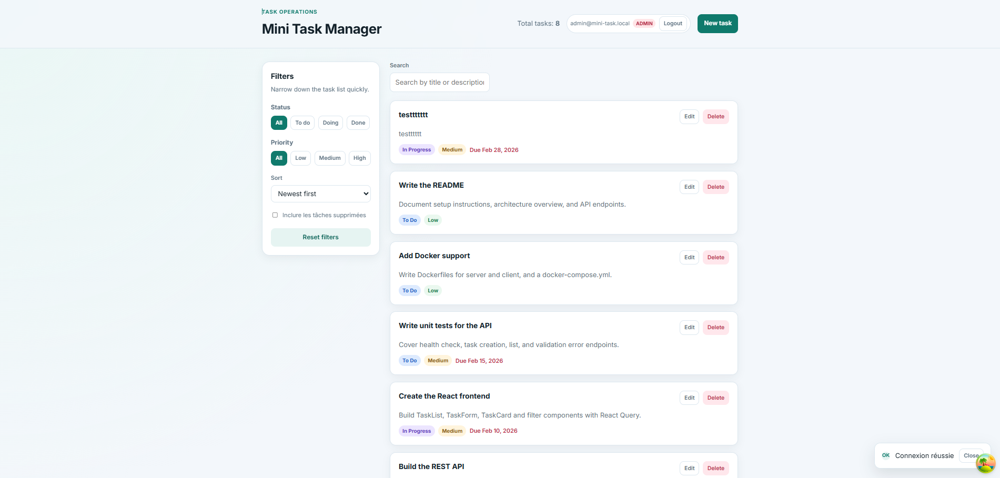

# Mini Task Manager

[](https://github.com/Therebeu621/mini-task-manager/actions/workflows/ci.yml)

Application fullstack TypeScript (monorepo npm workspaces) pour gérer des tâches, avec authentification JWT, RBAC, soft delete/restauration, pagination et UI orientée produit.

## Aperçu interface




## Stack technique

- Frontend: React + Vite + TypeScript + TanStack Query
- Backend: Node.js + Express + TypeScript + Prisma + SQLite
- Qualité: ESLint + Prettier + Vitest + Supertest
- DevOps: Docker + docker-compose + GitHub Actions (CI)

## Fonctionnalités

- Authentification: Register / Login / session JWT
- RBAC strict:
  - `user`: accès uniquement à ses tâches
  - `admin`: accès global + gestion des tâches supprimées
- CRUD tâches + restore:
  - `DELETE` = soft delete
  - `PATCH /api/tasks/:id/restore` = restauration
- Audit minimal sur `Task`:
  - `ownerId`, `createdById`, `updatedById`, `deletedAt`, `deletedById`
- Filtres/recherche/tri + pagination backend/frontend
- Optimistic updates (create/update/delete/restore) avec rollback si erreur
- UI responsive:
  - desktop: sidebar filtres + liste
  - mobile: drawer filtres

## Démarrage rapide (recommandé: Docker)

```bash
docker-compose up --build
```

- Front: `http://localhost:5173`
- API: `http://localhost:3001`

Seed de démo (optionnel):

```bash
docker-compose exec server npm run db:seed
```

## Démarrage local (développement)

```bash
npm install
cp server/.env.example server/.env
npm run db:push
npm run db:seed
npm run dev
```

URLs:

- Front: `http://localhost:5173`
- API: `http://localhost:3001`

Comptes seed par défaut:

- Admin: `admin@mini-task.local` / `Admin123!`
- User: `user@mini-task.local` / `User123!`

Tu peux les personnaliser via `SEED_*` dans `server/.env`.

## Endpoints API

Base URL: `http://localhost:3001`

### Santé

- `GET /api/health`

### Auth

- `POST /api/auth/register`
- `POST /api/auth/login`
- `GET /api/auth/me`

### Tasks (JWT requis)

- `GET /api/tasks`
- `POST /api/tasks`
- `GET /api/tasks/:id`
- `PUT /api/tasks/:id`
- `DELETE /api/tasks/:id` (soft delete)
- `PATCH /api/tasks/:id/restore`

### Query params de `GET /api/tasks`

- `status`: `todo|doing|done`
- `priority`: `low|medium|high`
- `search`: texte libre
- `sortBy`: `title|dueDate|createdAt|priority|status`
- `sortOrder`: `asc|desc`
- `page`: entier `>= 1` (défaut `1`)
- `limit`: entier `1..100` (défaut `10`)
- `includeDeleted`: `true|false` (**admin uniquement**, défaut `false`)

Exemple:

```bash
curl "http://localhost:3001/api/tasks?page=2&limit=10&status=doing&sortBy=createdAt&sortOrder=desc"
```

Comme les routes `/api/tasks*` sont protégées, voici un exemple complet avec JWT:

```bash
# 1) Login pour récupérer un token
curl -X POST http://localhost:3001/api/auth/login \
  -H "Content-Type: application/json" \
  -d '{"email":"user@mini-task.local","password":"User123!"}'
```

```bash
# 2) Appel d'une route tasks avec Authorization Bearer
curl "http://localhost:3001/api/tasks?page=1&limit=10" \
  -H "Authorization: Bearer <TOKEN>"
```

Réponse paginée:

```json
{
  "success": true,
  "data": [],
  "meta": {
    "page": 2,
    "limit": 10,
    "total": 37,
    "totalPages": 4
  }
}
```

## Commandes utiles

```bash
npm run lint
npm run test
npm run build
npm run format
```

## CI GitHub Actions

Workflow: `.github/workflows/ci.yml`

Déclenchement:

- push sur `main`
- pull_request vers `main`

Pipeline:

1. `npm ci`
2. `npm run lint`
3. `prisma generate` (server)
4. `npm run test`
5. `npm run build`

## Structure du repo

```text
.
├── client/
│   └── src/
│       ├── api/
│       ├── components/ui/
│       ├── features/
│       │   ├── auth/
│       │   └── tasks/
│       └── hooks/
├── server/
│   ├── prisma/
│   │   ├── migrations/
│   │   ├── schema.prisma
│   │   └── seed.ts
│   ├── src/
│   │   ├── controllers/
│   │   ├── middleware/
│   │   ├── routes/
│   │   ├── services/
│   │   └── validators/
│   └── tests/
└── .github/workflows/ci.yml
```

## Notes tests

- Tests backend couverts (auth + RBAC + soft delete/restore + pagination).
- Tests frontend non inclus dans cette V1 (focus API + intégration fullstack).

## Améliorations possibles

- Refresh token + rotation
- Pagination cursor-based
- Audit trail enrichi (historique détaillé par champ)
- Frontend tests (RTL + Vitest)
